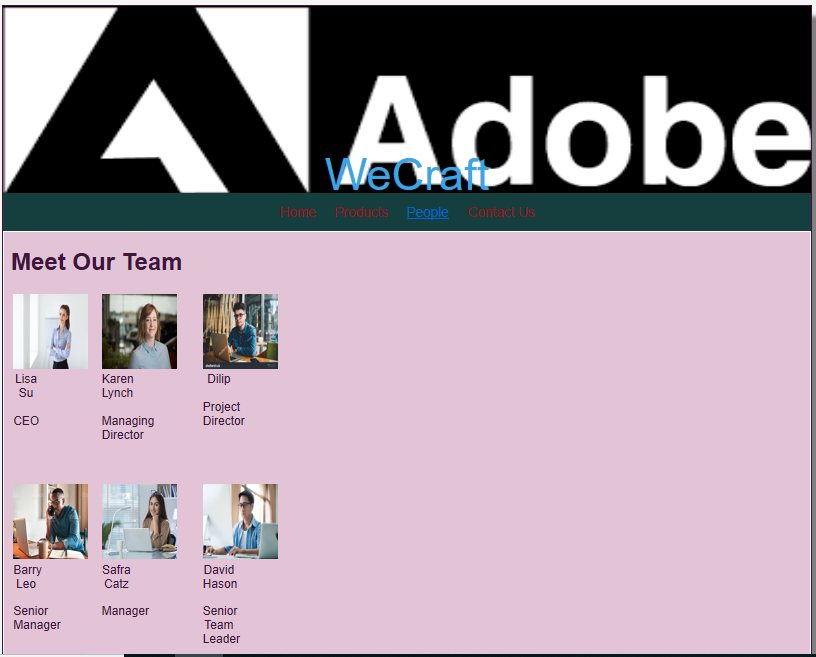
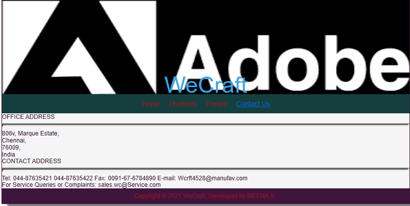
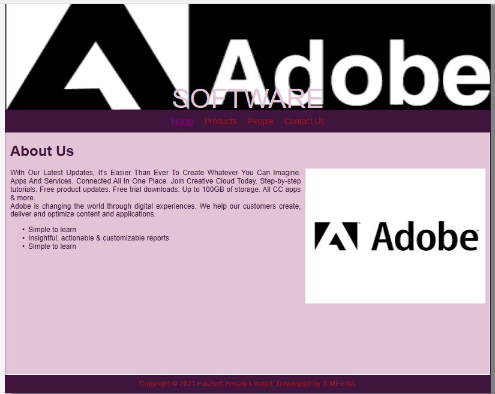
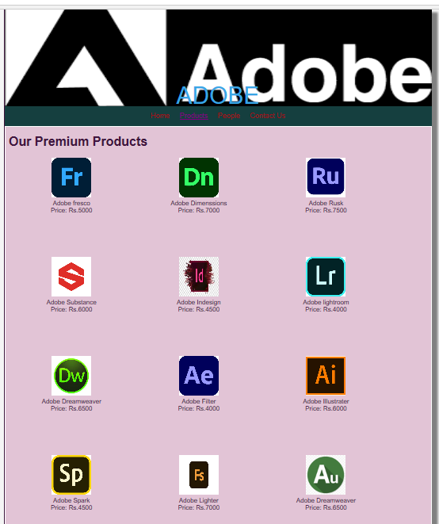

# Web Design for a Software Product Company

## AIM:

To design a static website for a software product company company.

## DESIGN STEPS:

### Step 1:

Requirement collection.

### Step 2:

Creating the layout using HTML and CSS.

### Step 3:

Updating the sample content.

### Step 4:

Choose the appropriate style and color scheme.

### Step 5:

Validate the layout in various browsers.

### Step 6:

Validate the HTML code.

### Step 6:

Publish the website in the given URL.

## PROGRAM :
## HOME PAGE:
```
<!DOCTYPE html>
<html lang="en">
  <head>
    <title>EduSoft Private Limited</title>
    <link rel="stylesheet" href="./css/layout.css" />
    <link rel="icon" href="./img/icon.png" type="image/x-icon" />
  </head>

  <body>
    <div class="container">
      <div class="banner">Phone store</div>
      <div class="menu">
        <div class="menuitemselected"><a href="/static/home.html">Home</a></div>
        <div class="menuitem"><a href="/static/products.html">Products</a></div>
        <div class="menuitem"><a>People</a></div>
        <div class="menuitem"><a>Contact Us</a></div>
      </div>
      <div class="content">
        <div class="homecontent">
          <h1>About Us</h1>
          
          <div class="contenttext">
            Mobile phones are no more merely a part of our lives.
             Whether it's to stay connected with friends and family or to keep abreast of important developments around the world, 
             mobiles are no longer for sending a text or making a call. 
             From budget to state-of-the-art smartphones; indigenous names to global big-wigs - a whole universe of mobiles await you on Flipkart
            <br />
            waterdrop notch screens, a high screen to body ratio, AI-powered sensational cameras, high storage capacity, 
            blazing quick processing engines or reflective glass designs,
             rest assured you won't have to venture anywhere else for your smartphone needs
            <ul>
              <li>Best offers with affordable prices</li>
              <li>Quality mobiles with guarantee</li>
              <li>Trustworthy shop </li>
            </ul>
          </div>
        </div>
      </div>
      <div class="footer">
        Copyright &#169; 2021 EduSoft Private Limited, Developed by S.MEENA.
      </div>
    </div>
  </body>
</html>
 
## PRODUCT PAGE:
<!DOCTYPE html>
<html lang="en">
  <head>
    <title>EduSoft Private Limited</title>
    <link rel="stylesheet" href="./css/layout.css" />
    <link rel="icon" href="./img/icon.png" type="image/x-icon" />
  </head>

  <body>
    <div class="container">
      <div class="banner">LAPTOPS</div>
      <div class="menu">
        <div class="menuitem"><a href="/static/home.html">Home</a></div>
        <div class="menuitemselected">
          <a href="/static/products.html">Products</a>
        </div>
        <div class="menuitem"><a>People</a></div>
        <div class="menuitem"><a>Contact Us</a></div>
      </div>
      <div class="content">
        <div class="productcontent">    
          <h1>Our Premium Products</h1>
          <div class="productitems">
              <div class="productitem"> 
                  <div class="itemimage">
                  
                  </div>
                  <div class="itemname">realme C25Y</div>
                  <div class="itemprice">Price: Rs.80,000 </div>
              </div>
              <div class="productitem"> 
                  <div class="itemimage">
                  
                  </div>
                  <div class="itemname">REALME 8I</div>
                  <div class="itemprice">Price: Rs.90,000 </div>
              </div>
              <div class="productitem"> 
                <div class="itemimage">
                
                </div>
                <div class="itemname">OPPO A12</div>
                </div>
                <div class="itemprice">Price: Rs.90,000 </div>
            </div>
            <div class="productitem"> 
              <div class="itemimage">
              
              </div>
              <div class="itemname">OPPO A16</div>
              <div class="itemprice">Price: Rs.1,25,000 </div>
          </div>
          <div class="productitem"> 
            <div class="itemimage">
            
            </div>
            <div class="itemname">OPPO A74</div>
            <div class="itemprice">Price: Rs.1,60,000 </div>
        </div>
        <div class="productitem"> 
          <div class="itemimage">
          
          </div>
          <div class="itemname">SAMSUNG S20 FE</div>
          <div class="itemprice">Price: Rs.80,000 </div>
      </div>
      <div class="productitem"> 
        <div class="itemimage">
        
        </div>
        <div class="itemname">SAMSUNG GALAXY M01</div>
        <div class="itemprice">Price: Rs.66,000 </div>
    </div>
    <div class="productitem"> 
      <div class="itemimage">
      
      </div>
      <div class="itemname">SAMSUNG M25</div>
      <div class="itemprice">Price: Rs.70,000 </div>
  </div>
  <div class="productitem"> 
    <div class="itemimage">
    
    </div>
    <div class="itemname">VIVO Y70</div>
    <div class="itemprice">Price: Rs.90,000 </div>
</div>
<div class="productitem"> 
  <div class="itemimage">
  
  </div>
  <div class="itemname">VIVO S10</div>
  <div class="itemprice">Price: Rs.95,000 </div>
</div>
<div class="productitem"> 
  <div class="itemimage">
  
  </div>
  <div class="itemname">ASUS ROG</div>
  <div class="itemprice">Price: Rs.89,000 </div>
</div>
<div class="productitem"> 
  <div class="itemimage">
  
  </div>
  <div class="itemname">ASUS ROG PHONE 5</div>
  <div class="itemprice">Price: Rs.77,000 </div>
</div>
          </div>
          </div>        
      </div>
      <div class="footer">
        Copyright &#169; 2021 EduSoft Private Limited, Developed by SITHI HAJARA.
      </div>
    </div>
  </body>
</html>

## PEOPLE PAGE:
<!DOCTYPE html>
<html lang="en">
  <head>
    <title>WeCraft</title>
    <link rel="stylesheet" href="./css/layout.css" />
    <link rel="icon" href="./img/icon.png" type="image/x-icon" />
  </head>

  <body>
    <div class="container">
      <div class="banner">WeCraft</div>
      <div class="menu">
        <div class="menuitem"><a href="/static/home.html">Home</a></div>
        <div class="menuitem">
          <a href="/static/products.html">Products</a>
        </div>
        <div class="menuitemselected"><a href="/static/people.html">People</a></div>
        <div class="menuitem"><a>Contact Us</a></div>
      </div>
      <div class="content">
        <div class="productcontent">    
          <h1>Meet Our Team</h1>
          <table>
            <tr> 
            <td>
              <div class="productitem"> 
                  <div class="itemimage">
                  
                  </div>
                  <div class="itemname">Lisa Su </div> <br>
                  <div class="itemprice"> CEO  </div> 
                </td>
            <td>
                <div class="productitem"> 
                    <div class="itemimage">
                    
                    </div>
                    <div class="itemname"> Karen Lynch </div> <br>
                    <div class="itemprice">Managing Director</div>
                </td>
                <td>
                    <div class="productitem"> 
                        <div class="itemimage">
                        
                        </div>
                        <div class="itemname">Dilip</div> <br>
                        <div class="itemprice">Project Director</div>

                </td>  
            </tr>
            <tr>
                <td>
                    <div class="productitem"> 
                        <div class="itemimage">
                        
                        </div>
                        <div class="itemname">Barry Leo</div> <br>
                        <div class="itemprice">Senior Manager</div>
                    </td>
                    <td>
                        <div class="productitem"> 
                            <div class="itemimage">
                            
                            </div>
                            <div class="itemname">Safra Catz</div><br>
                            <div class="itemprice"> Manager</div>

                    </td>
                    <td>
                        <div class="productitem"> 
                            <div class="itemimage">
                            
                            </div>
                            <div class="itemname">David Hason</div> <br>
                            <div class="itemprice">Senior Team Leader</div>
                    </td>

            </tr>    
            </table>
            </div>
            </div>
        </body>
        </html>

## CONTACT PAGE:

<!DOCTYPE html>
<html lang="en">
  <head>
    <title>WeCraft</title>
    <link rel="stylesheet" href="./css/layout.css" />
    <link rel="icon" href="./img/icon.png" type="image/x-icon" />
  </head>

  <body>
    <div class="container">
      <div class="banner">WeCraft</div>
      <div class="menu">
        <div class="menuitem"><a href="/static/home.html">Home</a></div>
        <div class="menuitem">
          <a href="/static/products.html">Products</a>
        </div>
        <div class="menuitem"><a href="/static/people.html">People</a></div>
        <div class="menuitemselected"><a href="/static/contactus.html">Contact Us</a></div>
      </div>
      <div class="contactus" background-image="url(/static/img/cbg.jpg")>
          OFFICE ADDRESS <br>
          <hr style="height:2px;border-width:5px;color:#e6752f;background-color: #e6752f">
          
          806v, 
          Marque Estate,<br>
          Chennai,<br>
          76009,<br>
          India<br>

          CONTACT ADDRESS<br>
          <hr style="height:2px;border-width:5px;color:#e6752f;background-color: #e6752f">
          
          Tel: 044-87635421
               044-87635422
          Fax: 0091-67-6784890
          E-mail: Wcrft4528@manufav.com
          <br>
           For Service Queries or Complaints: sales.wc@Service.com
        
        </div>
        <div class="footer">
            Copyright &#169; 2021 WeCraft, Developed by S.MEENA.
          </div>

      </div>
      </body>
      </html>
## OUTPUT:

### Home Page:
```

### Product page:

### People page:

### Contact us page:

## Result:

Thus a website is designed for the software product company and the HTML,CSS code are validated.
